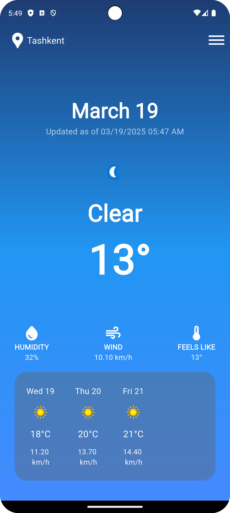

# Weather App

A simple Flutter-based weather application that displays current weather conditions and a 4-day forecast for Paris using the WeatherAPI.com service. The app features a responsive design with a gradient background, weather icons, and detailed metrics.

## Features
- Displays current weather conditions (temperature, humidity, wind speed, feels-like temperature) for Paris.
- Shows a 4-day weather forecast with daily temperature and wind speed.
- Responsive design using a custom `AppResponsive` utility.
- Gradient background for an enhanced visual experience.
- Integration with WeatherAPI.com for real-time weather data.
- Error handling for failed API requests.
- Custom widgets for modular UI components.

## Screenshots

### Prerequisites
- An API key from [WeatherAPI.com](https://www.weatherapi.com/).